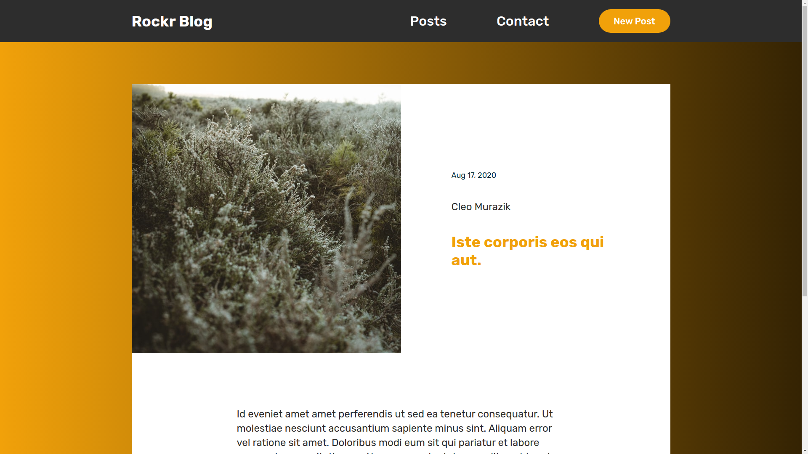
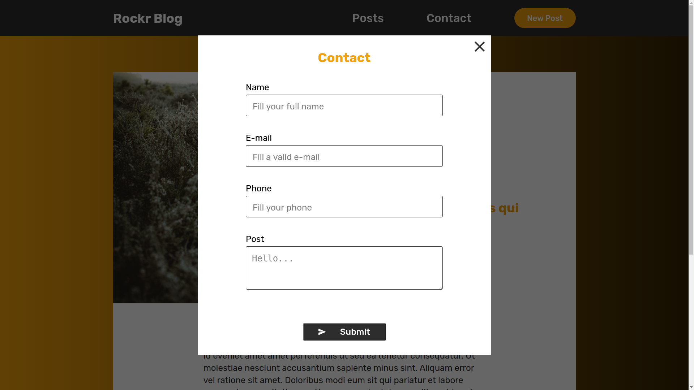
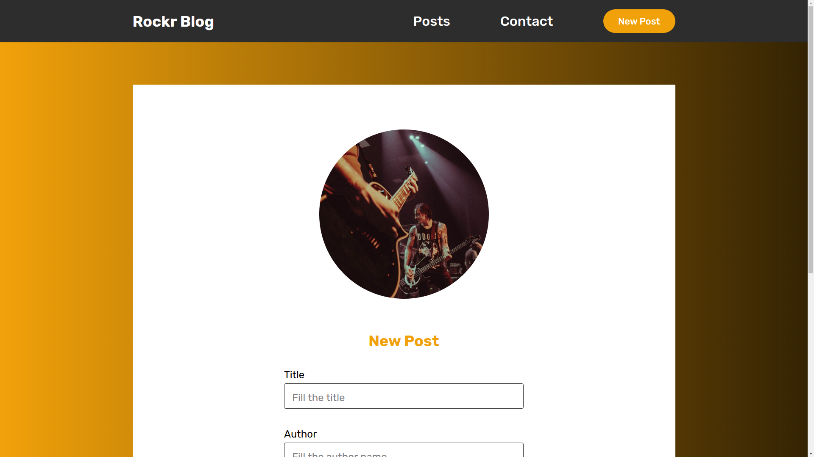

<h1 align="center">
  
</h1>

## Sobre

<p>Resultado do teste para vaga de desenvolvedor frontend júnior da <a href="https://coderockr.com/"                   target="_blank" rel="noopener noreferrer" >Coderockr</a></p>

## 🔧 Tecnologias

As seguintes ferramentas foram usadas na construção do projeto:

- [React](https://pt-br.reactjs.org/)
- [React Router Dom](https://reactrouter.com/web/guides/quick-start)
  - Utilizado no projeto para fazer o roteamento das páginas.
- [Axios](https://github.com/axios/axios)
  - Utilizado no projeto para fazer as requisições a API.
- [Styled Components](https://styled-components.com/)
   - Utilizado para facilitar na criação dos estilos.
- [Date Fns](https://date-fns.org/)
  - Utilizado para formatação de datas.


## 💻 Telas

<div align="center">

</div>

<div align="center">
 

  
</div>

<div align="center">
 

  
</div>

## Pré-requisitos

Antes de começar, você vai precisar ter instalado em sua máquina as seguintes ferramentas:
[Git](https://git-scm.com), [Node.js](https://nodejs.org/en/), [Yarn](https://classic.yarnpkg.com/lang/en/).
## 💾 Instalação

```bash
  # Faça um clone desse repositório:
  $ git clone https://github.com/rodrigosakamoto/coderockr.git

  # Acesse a pasta do projeto no terminal
  $ cd coderockr

  # Instale as dependências
  $ yarn ou npm install

  # Execute a aplicação
  $ yarn start
```
---
By Rodrigo Sakamoto

[](https://www.linkedin.com/in/rodrigo-sakamoto/)
[](mailto:rodosakamoto@gmail.com)
